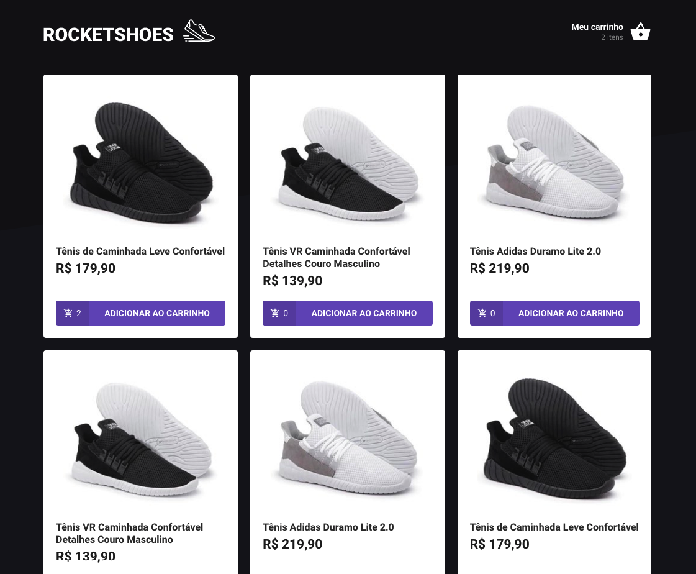
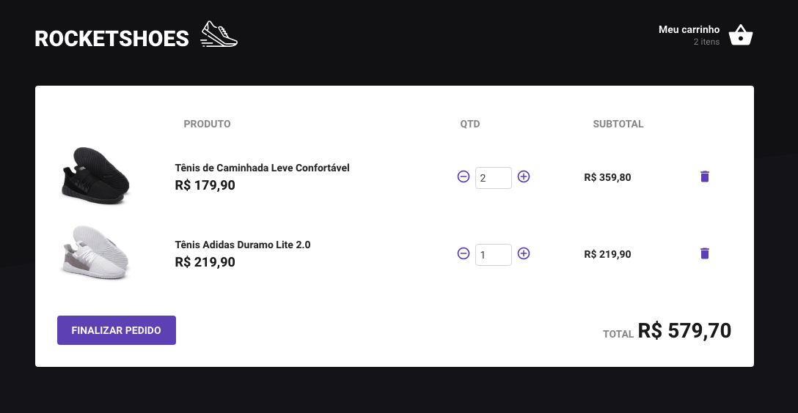

<h1 align="center">
    
</h1>

<h3 align="center">
  Rocketshoes - Aplicação desenvolvida durante o curso de ReactJS e React Native sobre Arquitetura Flux.
</h3>

<h3 align="center">
  #rocketseat, #reactjs, #reactnative, #redux, #reducer, #sagas, #action, #immer, #reactotron
</h3>

  

  

  

  

  <a href="#rocket-sobre-a-aplicação">Sobre a Aplicação</a>&nbsp;&nbsp;&nbsp;|&nbsp;&nbsp;&nbsp;
  <a href="#páginas-da-aplicação">Páginas da Aplicação</a>&nbsp;&nbsp;&nbsp;|&nbsp;&nbsp;&nbsp;
  <a href="#memo-licença">Licença</a>

## :rocket: Sobre a Aplicação

A aplicação que iremos dar início ao desenvolvimento a partir de agora é um site de vendas de sapatos, o **Rocketshoes**.

Abaixo segue todo o conteúdo que foi abordado no curso para o desenvolvimento da aplicação.

## Arquitetura Flux

- Conceitos do Redux
- Estrutura do projeto
- Configurando rotas
- Estilos globais
- Criando Header
- Estilização da Home
- Estilização do Carrinho
- Configurando API
- Buscando produtos da API
- Configurando o Redux
- Adicionando ao carrinho
- Reactotron + Redux
- Listando no carrinho
- Produto duplicado
- Remover produto
- Refatorando as actions
- Alterando quantidade
- Calculando totais
- Exibindo quantidades
- Configurando Redux Saga
- Reactotron + Saga
- Separando actions
- Estoque na adição
- React Toastify
- Estoque na alteração
- Navegando no Saga

## Páginas da Aplicação

### Página Principal

### Página do Carrinho

## :memo: Licença

Esse projeto está sob a licença MIT. Veja o arquivo [LICENSE](LICENSE.md) para mais detalhes.

---

Feito com ♥ by Rocketseat :wave: [Entre na nossa comunidade!](https://discordapp.com/invite/gCRAFhc)
